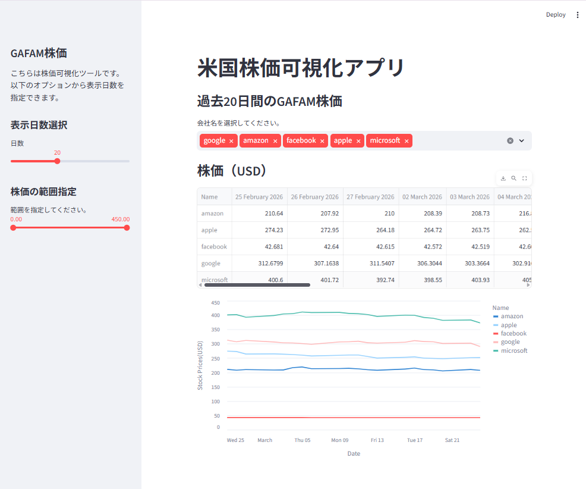
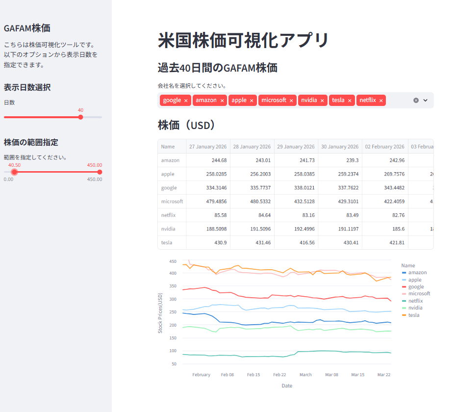

# stock-dashboard
Stock price visualization app using Python and Streamlit

# Stock Price Visualization App

## Overview
This is a simple stock price visualization app built with Python and Streamlit.
It retrieves stock data and displays price trends for analysis.

## 概要（日本語）
PythonとStreamlitを用いて株価データを可視化するアプリです。
データ取得からグラフ表示までの一連の流れを実装しています。

## Screenshots
Demo: Screenshots below show interactive UI and dynamic updates.

| Main View | UI |
|----------|----|
|  |  |

## Features
- Fetch stock price data
- Display time-series charts
- Select time range (days)

## Tech Stack
- Python
- Streamlit
- pandas
- yfinance
- matplotlib

## How to Run
1. Install required libraries
pip install -r requirements.txt

2. Run the app
streamlit run main.py

## Notes
This app was created as part of my learning project.
This project demonstrates basic data visualization and application development skills.
